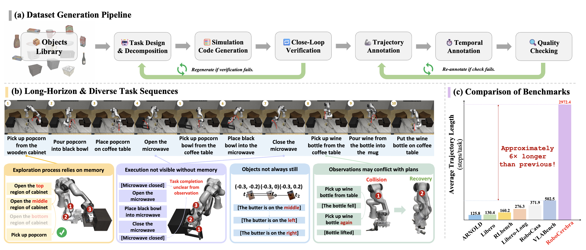

<div align="center">

<h1>RoboCerebra: A Large-scale Benchmark for Long-horizon Robotic Manipulation Evaluation</h1>

<div>
    Songhao Han&emsp;
    Boxiang Qiu&emsp;
    Yue Liao&emsp;
    Siyuan Huang&emsp;
    Chen Gao&emsp;
    Shuicheng Yan&emsp;
    Si Liu
</div>

<div>
    <strong>NeurIPS 2025</strong>
</div>

<div>
    <h4 align="center">
        <a href="https://www.arxiv.org/pdf/2506.06677" target="_blank">
        
        </a>
        <a href="https://robocerebra.github.io/" target="_blank">
        
        </a>
        <a href="https://huggingface.co/datasets/qiukingballball/RoboCerebraBench" target="_blank">
        
        </a>
        <a href="#citation">
        
        </a>
    </h4>
</div>

<strong>
RoboCerebra is a benchmark for evaluating long-horizon robotic
manipulation with an emphasis on high-level reasoning.
</strong>

<div>
    Project Page: <a href="https://robocerebra.github.io/" target="_blank">https://robocerebra.github.io/</a>
</div>

<div style="text-align:center">

</div>

---

</div>

## News

- **[2026-04-27]** The repository has been cleaned up around the main
  `evaluation/` pipeline and now passes the configured `pre-commit`
  checks.
- **[2025-11-10]** Initial public repository structure, evaluation code,
  and benchmark-related assets were published.

## Highlights

- **Long-horizon reasoning benchmark.** RoboCerebra focuses on robotic
  manipulation tasks that require multi-step planning and semantic
  reasoning rather than purely reactive control.
- **OpenVLA evaluation pipeline.** The repository includes an evaluation
  stack centered on OpenVLA-style policy execution under `evaluation/`.
- **Benchmark-oriented workflow.** The codebase is organized around
  dataset preparation, task execution, rollout recording, and result
  aggregation for reproducible benchmarking.

## Usage

### Repository Layout

- `evaluation/`: main evaluation entrypoint and task execution utilities
- `LIBERO/`: bundled environment dependency used by the evaluation stack
- `rlds_dataset_builder/`: dataset conversion utilities kept in the
  repository but not covered by the current cleanup
- `assets/`: figures used by the documentation

### Installation

Clone the repository:

```bash
git clone https://github.com/qiuboxiang/RoboCerebra.git
cd RoboCerebra
```

The evaluation code expects an OpenVLA-OFT environment plus the local
`LIBERO/` package from this repository.

```bash
conda create -n openvla-oft python=3.10 -y
conda activate openvla-oft

pip install torch torchvision torchaudio

git clone https://github.com/moojink/openvla-oft.git
cd openvla-oft
pip install -e .

pip install packaging ninja
ninja --version
pip install "flash-attn==2.5.5" --no-build-isolation

cd /path/to/RoboCerebra
pip install -e LIBERO
pip install -r openvla-oft/experiments/robot/libero/libero_requirements.txt
pip install "numpy>=1.23.5,<2.0.0"
pip install "peft>=0.17.0"
```

For evaluation-specific notes, see
[evaluation/README.md](/Users/qiuboxiang/RoboCerebra/evaluation/README.md).

### Data Preparation

Download the RoboCerebra benchmark from Hugging Face:

```bash
pip install huggingface_hub
huggingface-cli download \
  qiukingballball/RoboCerebraBench \
  --repo-type dataset \
  --local-dir ./RoboCerebra_Bench \
  --resume-download
```

### Model Preparation

The evaluation entrypoint reads its default paths from environment
variables instead of hard-coded local machine paths:

```bash
export ROBOCEREBRA_PRETRAINED_CHECKPOINT=/path/to/openvla/checkpoint
export ROBOCEREBRA_BENCH_ROOT=/path/to/RoboCerebra_Bench
```

Optional variables:

```bash
export ROBOCEREBRA_INIT_FILES_ROOT=/path/to/RoboCerebra_Bench/init_files
export WANDB_ENTITY=your_wandb_entity
export WANDB_PROJECT=your_wandb_project
```

### Evaluation

Run evaluation from the `evaluation/` directory so logs and rollout
videos are written there:

```bash
cd evaluation
python eval_openvla.py \
  --task_types '["Ideal", "Random_Disturbance"]' \
  --num_trials_per_task 1
```

Common overrides:

```bash
python eval_openvla.py \
  --pretrained_checkpoint /path/to/openvla/checkpoint \
  --robocerebra_root /path/to/RoboCerebra_Bench \
  --task_types '["Mix"]'
```

### Outputs

When launched from `evaluation/`, the run artifacts are written to:

- `experiments/logs/`: text logs and JSON summaries
- `rollouts/`: per-episode videos and metadata

## Citation

If you find this work useful, please consider citing our paper:

```bibtex
@article{han2025robocerebra,
  title={RoboCerebra: A Large-scale Benchmark for Long-horizon Robotic Manipulation Evaluation},
  author={Han, Songhao and Qiu, Boxiang and Liao, Yue and Huang, Siyuan and Gao, Chen and Yan, Shuicheng and Liu, Si},
  journal={arXiv preprint arXiv:2506.06677},
  year={2025}
}
```

## License

This project is licensed under the Apache-2.0 License. See
[LICENSE](LICENSE) for more information.

## Acknowledgement

- [OpenVLA-OFT](https://github.com/moojink/openvla-oft) for the model
  evaluation stack this repository builds around.
- `LIBERO/` and related robot environment tooling used by the benchmark
  evaluation pipeline.
